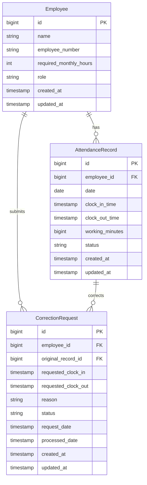

# 勤怠管理ツール設計書

## 概要

勤怠管理ツールは、Web アプリケーションとして実装します。フロントエンドは Vue.js（Nuxt.js）、バックエンドは AWS Lambda + API Gateway で構築し、従業員が簡単に打刻でき、勤務時間の管理と規定拘束時間の過不足確認ができるシステムです。

## アーキテクチャ

### 全体構成

```
┌─────────────────┐    ┌─────────────────┐    ┌─────────────────┐
│   Frontend      │    │   AWS Cloud     │    │    Database     │
│   (Nuxt.js)     │◄──►│  API Gateway    │◄──►│   RDS/PostgreSQL│
│                 │    │     Lambda      │    │                 │
│ - Pages         │    │ - Functions     │    │ - Tables        │
│ - Components    │    │ - Handlers      │    │ - DOMA Mappers  │
│ - Composables   │    │ - Services      │    │ - SQL Files     │
│ - Stores        │    │ - Entities      │    │                 │
└─────────────────┘    └─────────────────┘    └─────────────────┘
```

### 技術スタック

**フロントエンド**:

- **Framework**: Vue.js 3 + Nuxt.js 3
- **State Management**: Pinia
- **UI Library**: Vuetify 3 または PrimeVue
- **HTTP Client**: Nuxt $fetch / Axios
- **Date/Time**: Day.js

**バックエンド**:

- **Platform**: AWS Lambda
- **API Gateway**: AWS API Gateway
- **Language**: Java 17+
- **ORM**: DOMA 2
- **Database**: Amazon RDS (PostgreSQL 15+)
- **Build Tool**: Gradle
- **Framework**: AWS Lambda Java Runtime
- **Authentication**: AWS Cognito User Pools + Identity Pools
- **Authorization**: AWS Cognito Groups + IAM Roles

## コンポーネントと インターフェース

### 1. フロントエンド層 (Nuxt.js)

#### Pages

- `index.vue`: ダッシュボード画面
- `attendance/index.vue`: 打刻画面
- `records/index.vue`: 勤務記録確認画面
- `admin/employees.vue`: 従業員管理画面（管理者用）
- `corrections/index.vue`: 修正申請画面

#### Components

- `AttendanceCard.vue`: 打刻カードコンポーネント
- `RecordTable.vue`: 勤務記録テーブル
- `EmployeeForm.vue`: 従業員登録・編集フォーム
- `CorrectionRequestForm.vue`: 修正申請フォーム
- `WorkingHoursSummary.vue`: 勤務時間サマリー

#### Composables

- `useAttendance()`: 打刻機能のロジック
- `useRecords()`: 勤務記録取得・表示ロジック
- `useEmployees()`: 従業員管理ロジック
- `useCorrections()`: 修正申請ロジック
- `useAuth()`: 認証ロジック

#### Stores (Pinia)

- `attendanceStore`: 打刻状態管理
- `recordStore`: 勤務記録状態管理
- `employeeStore`: 従業員情報状態管理
- `authStore`: 認証状態管理

### 2. バックエンド層 (AWS Lambda + Java)

#### Lambda Functions

- `AttendanceLambda`: 打刻処理 Lambda 関数
- `RecordLambda`: 勤務記録取得 Lambda 関数
- `EmployeeLambda`: 従業員管理 Lambda 関数
- `CorrectionLambda`: 修正申請処理 Lambda 関数
- `AuthLambda`: 認証処理 Lambda 関数

#### Handlers

```java
public class AttendanceHandler implements RequestHandler<APIGatewayProxyRequestEvent, APIGatewayProxyResponseEvent> {
    private final AttendanceService attendanceService;

    @Override
    public APIGatewayProxyResponseEvent handleRequest(APIGatewayProxyRequestEvent input, Context context) {
        // 打刻処理のハンドリング
    }
}

public class RecordHandler implements RequestHandler<APIGatewayProxyRequestEvent, APIGatewayProxyResponseEvent> {
    private final RecordService recordService;

    @Override
    public APIGatewayProxyResponseEvent handleRequest(APIGatewayProxyRequestEvent input, Context context) {
        // 勤務記録処理のハンドリング
    }
}
```

#### Services

- `AttendanceService`: 打刻ビジネスロジック
- `RecordService`: 勤務記録計算・取得ロジック
- `EmployeeService`: 従業員管理ロジック
- `CorrectionService`: 修正申請処理ロジック
- `WorkingHoursCalculationService`: 勤務時間計算ロジック

#### Entities (DOMA)

```java
@Entity
@Table(name = "employees")
public class Employee {
    @Id
    @GeneratedValue(strategy = GenerationType.IDENTITY)
    private Long id;

    @Column(name = "name")
    private String name;

    @Column(name = "employee_number")
    private String employeeNumber;

    @Column(name = "required_monthly_hours")
    private Integer requiredMonthlyHours; // 140-180時間

    @Column(name = "role")
    @Enumerated(EnumType.STRING)
    private UserRole role;

    @Column(name = "created_at")
    private LocalDateTime createdAt;

    @Column(name = "updated_at")
    private LocalDateTime updatedAt;
}

@Entity
@Table(name = "attendance_records")
public class AttendanceRecord {
    @Id
    @GeneratedValue(strategy = GenerationType.IDENTITY)
    private Long id;

    @Column(name = "employee_id")
    private Long employeeId;

    @Column(name = "date")
    private LocalDate date;

    @Column(name = "clock_in_time")
    private LocalDateTime clockInTime;

    @Column(name = "clock_out_time")
    private LocalDateTime clockOutTime;

    @Column(name = "working_minutes")
    private Long workingMinutes;

    @Column(name = "status")
    @Enumerated(EnumType.STRING)
    private AttendanceStatus status;

    @Column(name = "created_at")
    private LocalDateTime createdAt;

    @Column(name = "updated_at")
    private LocalDateTime updatedAt;
}

@Entity
@Table(name = "correction_requests")
public class CorrectionRequest {
    @Id
    @GeneratedValue(strategy = GenerationType.IDENTITY)
    private Long id;

    @Column(name = "employee_id")
    private Long employeeId;

    @Column(name = "original_record_id")
    private Long originalRecordId;

    @Column(name = "requested_clock_in")
    private LocalDateTime requestedClockIn;

    @Column(name = "requested_clock_out")
    private LocalDateTime requestedClockOut;

    @Column(name = "reason")
    private String reason;

    @Column(name = "status")
    @Enumerated(EnumType.STRING)
    private CorrectionStatus status;

    @Column(name = "request_date")
    private LocalDateTime requestDate;

    @Column(name = "processed_date")
    private LocalDateTime processedDate;
}

public enum UserRole { EMPLOYEE, MANAGER, ADMIN }
public enum AttendanceStatus { PRESENT, ABSENT, PARTIAL }
public enum CorrectionStatus { PENDING, APPROVED, REJECTED }
```

### 3. データ層 (DOMA + Amazon RDS PostgreSQL)

#### DOMA Mappers

```java
@Dao
public interface AttendanceRecordDao {
    @Select
    AttendanceRecord selectById(Long id);

    @Select
    List<AttendanceRecord> selectByEmployeeIdAndMonth(Long employeeId, YearMonth month);

    @Select
    List<AttendanceRecord> selectAllByMonth(YearMonth month);

    @Insert
    Result<AttendanceRecord> insert(AttendanceRecord record);

    @Update
    Result<AttendanceRecord> update(AttendanceRecord record);

    @Delete
    Result<AttendanceRecord> delete(AttendanceRecord record);
}

@Dao
public interface EmployeeDao {
    @Select
    Employee selectById(Long id);

    @Select
    List<Employee> selectAll();

    @Select
    Employee selectByEmployeeNumber(String employeeNumber);

    @Insert
    Result<Employee> insert(Employee employee);

    @Update
    Result<Employee> update(Employee employee);

    @Delete
    Result<Employee> delete(Employee employee);
}

@Dao
public interface CorrectionRequestDao {
    @Select
    CorrectionRequest selectById(Long id);

    @Select
    List<CorrectionRequest> selectPendingRequests();

    @Select
    List<CorrectionRequest> selectByEmployeeId(Long employeeId);

    @Insert
    Result<CorrectionRequest> insert(CorrectionRequest request);

    @Update
    Result<CorrectionRequest> update(CorrectionRequest request);
}
```

#### Amazon RDS PostgreSQL Schema

```sql
-- employees テーブル
CREATE TABLE employees (
    id BIGSERIAL PRIMARY KEY,
    name VARCHAR(100) NOT NULL,
    employee_number VARCHAR(20) UNIQUE NOT NULL,
    required_monthly_hours INTEGER NOT NULL CHECK (required_monthly_hours BETWEEN 140 AND 180),
    role VARCHAR(20) NOT NULL CHECK (role IN ('EMPLOYEE', 'MANAGER', 'ADMIN')),
    created_at TIMESTAMP NOT NULL DEFAULT CURRENT_TIMESTAMP,
    updated_at TIMESTAMP NOT NULL DEFAULT CURRENT_TIMESTAMP
);

-- attendance_records テーブル
CREATE TABLE attendance_records (
    id BIGSERIAL PRIMARY KEY,
    employee_id BIGINT NOT NULL REFERENCES employees(id),
    date DATE NOT NULL,
    clock_in_time TIMESTAMP,
    clock_out_time TIMESTAMP,
    working_minutes BIGINT DEFAULT 0,
    status VARCHAR(20) NOT NULL CHECK (status IN ('PRESENT', 'ABSENT', 'PARTIAL')),
    created_at TIMESTAMP NOT NULL DEFAULT CURRENT_TIMESTAMP,
    updated_at TIMESTAMP NOT NULL DEFAULT CURRENT_TIMESTAMP,
    UNIQUE(employee_id, date)
);

-- correction_requests テーブル
CREATE TABLE correction_requests (
    id BIGSERIAL PRIMARY KEY,
    employee_id BIGINT NOT NULL REFERENCES employees(id),
    original_record_id BIGINT NOT NULL REFERENCES attendance_records(id),
    requested_clock_in TIMESTAMP,
    requested_clock_out TIMESTAMP,
    reason TEXT NOT NULL,
    status VARCHAR(20) NOT NULL CHECK (status IN ('PENDING', 'APPROVED', 'REJECTED')),
    request_date TIMESTAMP NOT NULL DEFAULT CURRENT_TIMESTAMP,
    processed_date TIMESTAMP,
    created_at TIMESTAMP NOT NULL DEFAULT CURRENT_TIMESTAMP,
    updated_at TIMESTAMP NOT NULL DEFAULT CURRENT_TIMESTAMP
);
```

## データモデル

### 主要エンティティの関係



## API 設計

### AWS API Gateway エンドポイント

#### 認証・認可 (AWS Cognito 統合)

**認証方式**: AWS Cognito User Pools + Identity Pools

- フロントエンドで Cognito SDK を使用してユーザー認証
- 認証後に Identity Pools から AWS クレデンシャルを取得
- API Gateway で Cognito Authorizer を使用してトークン検証

**権限管理**: Cognito Groups による役割ベースアクセス制御

- `employees` グループ: 一般従業員権限（自分の勤怠のみ）
- `managers` グループ: 管理者権限（部下の勤怠確認・修正承認）
- `admins` グループ: システム管理者権限（全従業員管理）

#### 打刻関連

- `POST /api/attendance/clock-in` - 出勤打刻
- `POST /api/attendance/clock-out` - 退勤打刻
- `GET /api/attendance/status` - 現在の打刻状態取得

#### 勤務記録関連

- `GET /api/records` - 勤務記録一覧取得
- `GET /api/records/{employeeId}` - 特定従業員の勤務記録取得
- `GET /api/records/{employeeId}/summary` - 月別勤務時間サマリー

#### 従業員管理関連

- `GET /api/employees` - 従業員一覧取得
- `POST /api/employees` - 従業員登録
- `PUT /api/employees/{id}` - 従業員情報更新
- `DELETE /api/employees/{id}` - 従業員削除

#### 修正申請関連

- `POST /api/corrections` - 修正申請提出
- `GET /api/corrections` - 修正申請一覧取得
- `PUT /api/corrections/{id}/approve` - 修正申請承認
- `PUT /api/corrections/{id}/reject` - 修正申請却下

### Lambda Function 構成

```yaml
# serverless.yml または SAM template
functions:
  attendance:
    handler: com.attendance.handler.AttendanceHandler
    events:
      - http:
          path: /attendance/{proxy+}
          method: ANY
          cors: true
          authorizer: aws_iam

  records:
    handler: com.attendance.handler.RecordHandler
    events:
      - http:
          path: /records/{proxy+}
          method: ANY
          cors: true
          authorizer: aws_iam

  employees:
    handler: com.attendance.handler.EmployeeHandler
    events:
      - http:
          path: /employees/{proxy+}
          method: ANY
          cors: true
          authorizer: aws_iam

  corrections:
    handler: com.attendance.handler.CorrectionHandler
    events:
      - http:
          path: /corrections/{proxy+}
          method: ANY
          cors: true
          authorizer: aws_iam
```

## エラーハンドリング

### エラー分類

1. **ビジネスロジックエラー**: 重複打刻、無効な時間など
2. **データベースエラー**: 接続失敗、制約違反など
3. **認証エラー**: 未認証、権限不足など
4. **バリデーションエラー**: 入力値不正など
5. **AWS サービスエラー**: Lambda タイムアウト、RDS 接続エラーなど

### エラー処理戦略

```java
// カスタム例外クラス
public class AttendanceException extends RuntimeException {
    private final ErrorCode errorCode;

    public AttendanceException(ErrorCode errorCode, String message) {
        super(message);
        this.errorCode = errorCode;
    }
}

public enum ErrorCode {
    ALREADY_CLOCKED_IN("ATTENDANCE_001", "既に出勤打刻済みです"),
    NOT_CLOCKED_IN("ATTENDANCE_002", "出勤打刻されていません"),
    INVALID_TIME_RANGE("ATTENDANCE_003", "無効な時間範囲です"),
    EMPLOYEE_NOT_FOUND("EMPLOYEE_001", "従業員が見つかりません"),
    UNAUTHORIZED("AUTH_001", "認証が必要です"),
    FORBIDDEN("AUTH_002", "権限がありません"),
    LAMBDA_TIMEOUT("AWS_001", "処理がタイムアウトしました"),
    DATABASE_CONNECTION_ERROR("DB_001", "データベース接続エラー");

    private final String code;
    private final String message;
}

// Lambda用エラーレスポンス
public class LambdaErrorResponse {
    private int statusCode;
    private Map<String, String> headers;
    private String body; // JSON形式のエラー情報

    public static LambdaErrorResponse create(ErrorCode errorCode, String message) {
        return new LambdaErrorResponse(
            errorCode.getHttpStatus(),
            Map.of("Content-Type", "application/json"),
            JsonUtils.toJson(new ErrorDetail(errorCode.getCode(), message))
        );
    }
}
```

## テスト戦略

### テストピラミッド

1. **Unit Tests**: Service 層、計算ロジック
2. **Integration Tests**: Lambda Handler、Database 操作
3. **E2E Tests**: フロントエンドから AWS 環境までの統合テスト

### テスト対象の優先順位

1. 打刻機能（出勤・退勤）
2. 勤務時間計算ロジック
3. 規定拘束時間過不足計算
4. 修正申請ワークフロー
5. 従業員管理機能

### テストツール

**バックエンド**:

- **Unit Testing**: JUnit 5, Mockito
- **Lambda Testing**: AWS Lambda Java Test Utils
- **Integration Testing**: TestContainers (PostgreSQL)
- **Local Testing**: SAM CLI Local

**フロントエンド**:

- **Unit Testing**: Vitest, Vue Test Utils
- **E2E Testing**: Playwright または Cypress
- **Component Testing**: Storybook

**AWS 環境**:

- **Infrastructure Testing**: AWS CDK Unit Tests
- **API Testing**: Postman/Newman, REST Assured

## AWS Cognito 認証・認可設定

### Cognito User Pools 設定

```yaml
# CloudFormation/SAM Template
CognitoUserPool:
  Type: AWS::Cognito::UserPool
  Properties:
    UserPoolName: attendance-user-pool
    UsernameAttributes:
      - email
    Policies:
      PasswordPolicy:
        MinimumLength: 8
        RequireUppercase: true
        RequireLowercase: true
        RequireNumbers: true
    Schema:
      - Name: employee_number
        AttributeDataType: String
        Required: true
        Mutable: true
      - Name: role
        AttributeDataType: String
        Required: true
        Mutable: true

CognitoUserPoolClient:
  Type: AWS::Cognito::UserPoolClient
  Properties:
    ClientName: attendance-client
    UserPoolId: !Ref CognitoUserPool
    GenerateSecret: false
    ExplicitAuthFlows:
      - ADMIN_NO_SRP_AUTH
      - USER_PASSWORD_AUTH
      - USER_SRP_AUTH

# Cognito Groups for Role-Based Access Control
EmployeesGroup:
  Type: AWS::Cognito::UserPoolGroup
  Properties:
    GroupName: employees
    Description: General employees
    UserPoolId: !Ref CognitoUserPool
    RoleArn: !GetAtt EmployeeRole.Arn

ManagersGroup:
  Type: AWS::Cognito::UserPoolGroup
  Properties:
    GroupName: managers
    Description: Managers with approval rights
    UserPoolId: !Ref CognitoUserPool
    RoleArn: !GetAtt ManagerRole.Arn

AdminsGroup:
  Type: AWS::Cognito::UserPoolGroup
  Properties:
    GroupName: admins
    Description: System administrators
    UserPoolId: !Ref CognitoUserPool
    RoleArn: !GetAtt AdminRole.Arn
```

### IAM Roles for Cognito Groups

```yaml
# Employee Role - 自分の勤怠のみアクセス可能
EmployeeRole:
  Type: AWS::IAM::Role
  Properties:
    AssumeRolePolicyDocument:
      Version: "2012-10-17"
      Statement:
        - Effect: Allow
          Principal:
            Federated: cognito-identity.amazonaws.com
          Action: sts:AssumeRoleWithWebIdentity
          Condition:
            StringEquals:
              "cognito-identity.amazonaws.com:aud": !Ref CognitoIdentityPool
    Policies:
      - PolicyName: EmployeeAttendancePolicy
        PolicyDocument:
          Version: "2012-10-17"
          Statement:
            - Effect: Allow
              Action:
                - execute-api:Invoke
              Resource:
                - !Sub "${ApiGatewayRestApi}/*/GET/api/attendance/status"
                - !Sub "${ApiGatewayRestApi}/*/POST/api/attendance/clock-in"
                - !Sub "${ApiGatewayRestApi}/*/POST/api/attendance/clock-out"
                - !Sub "${ApiGatewayRestApi}/*/GET/api/records/${cognito-identity.amazonaws.com:sub}"
                - !Sub "${ApiGatewayRestApi}/*/POST/api/corrections"

# Manager Role - 部下の勤怠確認・修正承認が可能
ManagerRole:
  Type: AWS::IAM::Role
  Properties:
    AssumeRolePolicyDocument:
      Version: "2012-10-17"
      Statement:
        - Effect: Allow
          Principal:
            Federated: cognito-identity.amazonaws.com
          Action: sts:AssumeRoleWithWebIdentity
          Condition:
            StringEquals:
              "cognito-identity.amazonaws.com:aud": !Ref CognitoIdentityPool
    Policies:
      - PolicyName: ManagerAttendancePolicy
        PolicyDocument:
          Version: "2012-10-17"
          Statement:
            - Effect: Allow
              Action:
                - execute-api:Invoke
              Resource:
                - !Sub "${ApiGatewayRestApi}/*/GET/api/records"
                - !Sub "${ApiGatewayRestApi}/*/GET/api/records/*"
                - !Sub "${ApiGatewayRestApi}/*/GET/api/corrections"
                - !Sub "${ApiGatewayRestApi}/*/PUT/api/corrections/*/approve"
                - !Sub "${ApiGatewayRestApi}/*/PUT/api/corrections/*/reject"

# Admin Role - 全機能アクセス可能
AdminRole:
  Type: AWS::IAM::Role
  Properties:
    AssumeRolePolicyDocument:
      Version: "2012-10-17"
      Statement:
        - Effect: Allow
          Principal:
            Federated: cognito-identity.amazonaws.com
          Action: sts:AssumeRoleWithWebIdentity
          Condition:
            StringEquals:
              "cognito-identity.amazonaws.com:aud": !Ref CognitoIdentityPool
    Policies:
      - PolicyName: AdminAttendancePolicy
        PolicyDocument:
          Version: "2012-10-17"
          Statement:
            - Effect: Allow
              Action:
                - execute-api:Invoke
              Resource:
                - !Sub "${ApiGatewayRestApi}/*/*"
```

### フロントエンド認証実装 (Nuxt.js)

```javascript
// composables/useAuth.js
import { Auth } from "aws-amplify";

export const useAuth = () => {
  const user = ref(null);
  const isAuthenticated = ref(false);
  const userGroups = ref([]);

  const signIn = async (email, password) => {
    try {
      const result = await Auth.signIn(email, password);
      user.value = result;
      isAuthenticated.value = true;

      // ユーザーのグループ情報を取得
      const session = await Auth.currentSession();
      const groups = session.getIdToken().payload["cognito:groups"] || [];
      userGroups.value = groups;

      return result;
    } catch (error) {
      throw error;
    }
  };

  const signOut = async () => {
    try {
      await Auth.signOut();
      user.value = null;
      isAuthenticated.value = false;
      userGroups.value = [];
    } catch (error) {
      throw error;
    }
  };

  const getCurrentUser = async () => {
    try {
      const currentUser = await Auth.currentAuthenticatedUser();
      user.value = currentUser;
      isAuthenticated.value = true;

      const session = await Auth.currentSession();
      const groups = session.getIdToken().payload["cognito:groups"] || [];
      userGroups.value = groups;

      return currentUser;
    } catch (error) {
      user.value = null;
      isAuthenticated.value = false;
      userGroups.value = [];
      return null;
    }
  };

  const hasRole = (role) => {
    return userGroups.value.includes(role);
  };

  const isEmployee = computed(() => hasRole("employees"));
  const isManager = computed(() => hasRole("managers"));
  const isAdmin = computed(() => hasRole("admins"));

  return {
    user: readonly(user),
    isAuthenticated: readonly(isAuthenticated),
    userGroups: readonly(userGroups),
    isEmployee,
    isManager,
    isAdmin,
    signIn,
    signOut,
    getCurrentUser,
    hasRole,
  };
};
```

## UI/UX デザイン - Apple Human Interface Guidelines 準拠

### デザイン原則

**1. 明確性 (Clarity)**

- 重要な情報を明確に表示
- 打刻ボタンは大きく、視認性の高い配置
- システムフォント（SF Pro）を使用した読みやすいテキスト

**2. 一貫性 (Consistency)**

- 全画面で統一されたナビゲーション
- 一貫したカラーパレットとタイポグラフィ
- 標準的な iOS コンポーネントパターンの採用

**3. 階層の深さ (Depth)**

- カードベースのレイアウト
- 適切な影とエレベーション
- 視覚的階層による情報整理

### カラーパレット

```css
/* Apple HIG準拠カラーシステム */
:root {
  /* Primary Colors */
  --color-primary: #007aff; /* System Blue */
  --color-primary-dark: #0051d5; /* System Blue (Dark) */

  /* Secondary Colors */
  --color-secondary: #5856d6; /* System Purple */
  --color-success: #34c759; /* System Green */
  --color-warning: #ff9500; /* System Orange */
  --color-error: #ff3b30; /* System Red */

  /* Neutral Colors */
  --color-background: #f2f2f7; /* System Background */
  --color-surface: #ffffff; /* System Background Secondary */
  --color-surface-secondary: #f2f2f7; /* System Background Tertiary */

  /* Text Colors */
  --color-text-primary: #000000; /* Label Primary */
  --color-text-secondary: #3c3c43; /* Label Secondary */
  --color-text-tertiary: #3c3c4399; /* Label Tertiary */

  /* Dark Mode Support */
  @media (prefers-color-scheme: dark) {
    --color-background: #000000;
    --color-surface: #1c1c1e;
    --color-surface-secondary: #2c2c2e;
    --color-text-primary: #ffffff;
    --color-text-secondary: #ebebf5;
    --color-text-tertiary: #ebebf599;
  }
}
```

### タイポグラフィ

```css
/* Apple HIG準拠タイポグラフィ */
.typography {
  /* Large Title */
  --font-large-title: -apple-system, BlinkMacSystemFont, "SF Pro Display",
    sans-serif;
  --font-size-large-title: 34px;
  --font-weight-large-title: 400;
  --line-height-large-title: 41px;

  /* Title 1 */
  --font-title1: -apple-system, BlinkMacSystemFont, "SF Pro Display", sans-serif;
  --font-size-title1: 28px;
  --font-weight-title1: 400;
  --line-height-title1: 34px;

  /* Title 2 */
  --font-title2: -apple-system, BlinkMacSystemFont, "SF Pro Display", sans-serif;
  --font-size-title2: 22px;
  --font-weight-title2: 400;
  --line-height-title2: 28px;

  /* Headline */
  --font-headline: -apple-system, BlinkMacSystemFont, "SF Pro Text", sans-serif;
  --font-size-headline: 17px;
  --font-weight-headline: 600;
  --line-height-headline: 22px;

  /* Body */
  --font-body: -apple-system, BlinkMacSystemFont, "SF Pro Text", sans-serif;
  --font-size-body: 17px;
  --font-weight-body: 400;
  --line-height-body: 22px;

  /* Caption */
  --font-caption: -apple-system, BlinkMacSystemFont, "SF Pro Text", sans-serif;
  --font-size-caption: 12px;
  --font-weight-caption: 400;
  --line-height-caption: 16px;
}
```

### コンポーネント設計

#### 1. 打刻カード (AttendanceCard.vue)

```vue
<template>
  <div class="attendance-card">
    <div class="card-header">
      <h2 class="title2">今日の勤怠</h2>
      <span class="caption current-time">{{ currentTime }}</span>
    </div>

    <div class="attendance-status">
      <div class="status-indicator" :class="statusClass">
        <Icon :name="statusIcon" size="24" />
      </div>
      <div class="status-text">
        <p class="headline">{{ statusMessage }}</p>
        <p class="caption">{{ workingTime }}</p>
      </div>
    </div>

    <div class="action-buttons">
      <Button
        :variant="clockInEnabled ? 'primary' : 'disabled'"
        size="large"
        @click="clockIn"
        :disabled="!clockInEnabled"
      >
        <Icon name="clock.arrow.2.circlepath" />
        出勤
      </Button>

      <Button
        :variant="clockOutEnabled ? 'secondary' : 'disabled'"
        size="large"
        @click="clockOut"
        :disabled="!clockOutEnabled"
      >
        <Icon name="clock.arrow.circlepath" />
        退勤
      </Button>
    </div>
  </div>
</template>

<style scoped>
.attendance-card {
  background: var(--color-surface);
  border-radius: 12px;
  padding: 20px;
  box-shadow: 0 1px 3px rgba(0, 0, 0, 0.1);
  margin: 16px;
}

.card-header {
  display: flex;
  justify-content: space-between;
  align-items: center;
  margin-bottom: 24px;
}

.title2 {
  font: var(--font-title2);
  font-size: var(--font-size-title2);
  font-weight: var(--font-weight-title2);
  line-height: var(--line-height-title2);
  color: var(--color-text-primary);
  margin: 0;
}

.attendance-status {
  display: flex;
  align-items: center;
  margin-bottom: 32px;
  padding: 16px;
  background: var(--color-surface-secondary);
  border-radius: 8px;
}

.status-indicator {
  width: 44px;
  height: 44px;
  border-radius: 22px;
  display: flex;
  align-items: center;
  justify-content: center;
  margin-right: 16px;
}

.status-indicator.working {
  background: var(--color-success);
  color: white;
}

.status-indicator.not-working {
  background: var(--color-text-tertiary);
  color: white;
}

.action-buttons {
  display: grid;
  grid-template-columns: 1fr 1fr;
  gap: 12px;
}
</style>
```

#### 2. ボタンコンポーネント (Button.vue)

```vue
<template>
  <button :class="buttonClasses" :disabled="disabled" @click="$emit('click')">
    <slot />
  </button>
</template>

<script setup>
const props = defineProps({
  variant: {
    type: String,
    default: "primary",
    validator: (value) =>
      ["primary", "secondary", "tertiary", "disabled"].includes(value),
  },
  size: {
    type: String,
    default: "medium",
    validator: (value) => ["small", "medium", "large"].includes(value),
  },
  disabled: {
    type: Boolean,
    default: false,
  },
});

const buttonClasses = computed(() => [
  "button",
  `button--${props.variant}`,
  `button--${props.size}`,
  { "button--disabled": props.disabled },
]);
</script>

<style scoped>
.button {
  display: inline-flex;
  align-items: center;
  justify-content: center;
  gap: 8px;
  border: none;
  border-radius: 8px;
  font: var(--font-body);
  font-weight: 600;
  cursor: pointer;
  transition: all 0.2s ease;
  min-height: 44px; /* Apple推奨のタッチターゲットサイズ */
}

.button--primary {
  background: var(--color-primary);
  color: white;
}

.button--primary:hover {
  background: var(--color-primary-dark);
}

.button--secondary {
  background: var(--color-surface-secondary);
  color: var(--color-primary);
  border: 1px solid var(--color-primary);
}

.button--large {
  padding: 12px 24px;
  font-size: 17px;
}

.button--medium {
  padding: 8px 16px;
  font-size: 15px;
}

.button--small {
  padding: 6px 12px;
  font-size: 13px;
  min-height: 32px;
}

.button--disabled {
  opacity: 0.3;
  cursor: not-allowed;
}
</style>
```

#### 3. ナビゲーション (Navigation.vue)

```vue
<template>
  <nav class="navigation">
    <div class="nav-container">
      <div class="nav-brand">
        <Icon name="clock.fill" size="24" />
        <span class="headline">勤怠管理</span>
      </div>

      <div class="nav-items">
        <NuxtLink
          v-for="item in navigationItems"
          :key="item.path"
          :to="item.path"
          class="nav-item"
          :class="{ 'nav-item--active': $route.path === item.path }"
        >
          <Icon :name="item.icon" size="20" />
          <span class="caption">{{ item.label }}</span>
        </NuxtLink>
      </div>

      <div class="nav-user">
        <UserAvatar :user="currentUser" />
      </div>
    </div>
  </nav>
</template>

<style scoped>
.navigation {
  background: var(--color-surface);
  border-bottom: 1px solid var(--color-surface-secondary);
  position: sticky;
  top: 0;
  z-index: 100;
}

.nav-container {
  display: flex;
  align-items: center;
  justify-content: space-between;
  padding: 12px 20px;
  max-width: 1200px;
  margin: 0 auto;
}

.nav-brand {
  display: flex;
  align-items: center;
  gap: 8px;
  color: var(--color-primary);
}

.nav-items {
  display: flex;
  gap: 24px;
}

.nav-item {
  display: flex;
  flex-direction: column;
  align-items: center;
  gap: 4px;
  padding: 8px 12px;
  border-radius: 8px;
  text-decoration: none;
  color: var(--color-text-secondary);
  transition: all 0.2s ease;
  min-width: 44px; /* タッチターゲットサイズ */
}

.nav-item:hover {
  background: var(--color-surface-secondary);
  color: var(--color-primary);
}

.nav-item--active {
  color: var(--color-primary);
  background: var(--color-surface-secondary);
}
</style>
```

### レスポンシブデザイン

```css
/* Apple HIG準拠のブレークポイント */
@media (max-width: 768px) {
  /* iPhone/iPad Portrait */
  .attendance-card {
    margin: 12px;
    padding: 16px;
  }

  .action-buttons {
    grid-template-columns: 1fr;
    gap: 8px;
  }

  .nav-items {
    display: none; /* モバイルではハンバーガーメニュー */
  }
}

@media (min-width: 769px) and (max-width: 1024px) {
  /* iPad Landscape */
  .nav-container {
    padding: 16px 32px;
  }
}

@media (min-width: 1025px) {
  /* Desktop */
  .nav-container {
    padding: 20px 40px;
  }
}
```

### アクセシビリティ

```css
/* Apple HIG準拠のアクセシビリティ */
@media (prefers-reduced-motion: reduce) {
  * {
    animation-duration: 0.01ms !important;
    animation-iteration-count: 1 !important;
    transition-duration: 0.01ms !important;
  }
}

@media (prefers-contrast: high) {
  :root {
    --color-primary: #0040dd;
    --color-text-secondary: #000000;
  }
}

/* フォーカス表示 */
.button:focus,
.nav-item:focus {
  outline: 2px solid var(--color-primary);
  outline-offset: 2px;
}

/* タッチターゲットサイズ（最小44px） */
.button,
.nav-item,
.touch-target {
  min-height: 44px;
  min-width: 44px;
}
```

## CI/CD パイプライン設計 - AWS CodePipeline

### 全体アーキテクチャ

```
┌─────────────────┐    ┌─────────────────┐    ┌─────────────────┐    ┌─────────────────┐
│   GitHub        │    │  CodePipeline   │    │   CodeBuild     │    │  AWS Services   │
│   Repository    │───►│   Pipeline      │───►│   Projects      │───►│   Deployment    │
│                 │    │                 │    │                 │    │                 │
│ - Frontend      │    │ - Source Stage  │    │ - Infrastructure│    │ - CloudFormation│
│ - Backend       │    │ - Build Stage   │    │ - Frontend Build│    │ - Lambda        │
│ - Infrastructure│    │ - Deploy Stage  │    │ - Backend Build │    │ - S3/CloudFront │
└─────────────────┘    └─────────────────┘    └─────────────────┘    └─────────────────┘
```

### リポジトリ構造

```
attendance-management/
├── infrastructure/
│   ├── cloudformation/
│   │   ├── main.yaml                 # メインスタック
│   │   ├── cognito.yaml             # Cognito設定
│   │   ├── api-gateway.yaml         # API Gateway設定
│   │   ├── lambda.yaml              # Lambda関数設定
│   │   ├── rds.yaml                 # RDS設定
│   │   └── frontend.yaml            # S3/CloudFront設定
│   ├── scripts/
│   │   ├── deploy.sh                # デプロイスクリプト
│   │   └── cleanup.sh               # クリーンアップスクリプト
│   └── parameters/
│       ├── dev.json                 # 開発環境パラメータ
│       ├── staging.json             # ステージング環境パラメータ
│       └── prod.json                # 本番環境パラメータ
├── backend/
│   ├── src/
│   │   └── main/java/com/attendance/
│   ├── build.gradle
│   ├── buildspec.yml                # CodeBuild設定
│   └── Dockerfile                   # Lambda用コンテナ
├── frontend/
│   ├── pages/
│   ├── components/
│   ├── package.json
│   ├── nuxt.config.ts
│   └── buildspec.yml                # CodeBuild設定
└── pipeline/
    ├── codepipeline.yaml            # パイプライン定義
    ├── codebuild-projects.yaml      # CodeBuildプロジェクト定義
    └── iam-roles.yaml               # IAMロール定義
```

### CodePipeline 設定

```yaml
# pipeline/codepipeline.yaml
AWSTemplateFormatVersion: '2010-09-09'
Description: 'Attendance Management CI/CD Pipeline'

Parameters:
  GitHubOwner:
    Type: String
    Description: GitHub repository owner
  GitHubRepo:
    Type: String
    Description: GitHub repository name
    Default: attendance-management
  GitHubBranch:
    Type: String
    Description: GitHub branch name
    Default: main
  Environment:
    Type: String
    Description: Deployment environment
    Default: dev
    AllowedValues: [dev, staging, prod]

Resources:
  # S3 Bucket for Pipeline Artifacts
  PipelineArtifactsBucket:
    Type: AWS::S3::Bucket
    Properties:
      BucketName: !Sub '${AWS::StackName}-pipeline-artifacts-${AWS::AccountId}'
      VersioningConfiguration:
        Status: Enabled
      BucketEncryption:
        ServerSideEncryptionConfiguration:
          - ServerSideEncryptionByDefault:
              SSEAlgorithm: AES256
      PublicAccessBlockConfiguration:
        BlockPublicAcls: true
        BlockPublicPolicy: true
        IgnorePublicAcls: true
        RestrictPublicBuckets: true

  # CodePipeline Service Role
  CodePipelineServiceRole:
    Type: AWS::IAM::Role
    Properties:
      AssumeRolePolicyDocument:
        Version: '2012-10-17'
        Statement:
          - Effect: Allow
            Principal:
              Service: codepipeline.amazonaws.com
            Action: sts:AssumeRole
      Policies:
        - PolicyName: CodePipelinePolicy
          PolicyDocument:
            Version: '2012-10-17'
            Statement:
              - Effect: Allow
                Action:
                  - s3:GetBucketVersioning
                  - s3:GetObject
                  - s3:GetObjectVersion
                  - s3:PutObject
                Resource:
                  - !Sub '${PipelineArtifactsBucket}/*'
                  - !GetAtt PipelineArtifactsBucket.Arn
              - Effect: Allow
                Action:
                  - codebuild:BatchGetBuilds
                  - codebuild:StartBuild
                Resource:
                  - !GetAtt InfrastructureBuildProject.Arn
                  - !GetAtt BackendBuildProject.Arn
                  - !GetAtt FrontendBuildProject.Arn
              - Effect: Allow
                Action:
                  - cloudformation:CreateStack
                  - cloudformation:UpdateStack
                  - cloudformation:DescribeStacks
                  - cloudformation:DescribeStackEvents
                  - cloudformation:DescribeStackResources
                  - cloudformation:GetTemplate
                Resource: '*'

  # Main Pipeline
  AttendancePipeline:
    Type: AWS::CodePipeline::Pipeline
    Properties:
      Name: !Sub '${AWS::StackName}-pipeline'
      RoleArn: !GetAtt CodePipelineServiceRole.Arn
      ArtifactStore:
        Type: S3
        Location: !Ref PipelineArtifactsBucket
      Stages:
        # Source Stage
        - Name: Source
          Actions:
            - Name: SourceAction
              ActionTypeId:
                Category: Source
                Owner: ThirdParty
                Provider: GitHub
                Version: '1'
              Configuration:
                Owner: !Ref GitHubOwner
                Repo: !Ref GitHubRepo
                Branch: !Ref GitHubBranch
                OAuthToken: !Ref GitHubToken
                PollForSourceChanges: false
              OutputArtifacts:
                - Name: SourceOutput

        # Build Stage
        - Name: Build
          Actions:
            - Name: BuildInfrastructure
              ActionTypeId:
                Category: Build
                Owner: AWS
                Provider: CodeBuild
                Version: '1'
              Configuration:
                ProjectName: !Ref InfrastructureBuildProject
              InputArtifacts:
                - Name: SourceOutput
              OutputArtifacts:
                - Name: InfrastructureOutput
              RunOrder: 1

            - Name: BuildBackend
              ActionTypeId:
                Category: Build
                Owner: AWS
                Provider: CodeBuild
                Version: '1'
              Configuration:
                ProjectName: !Ref BackendBuildProject
              InputArtifacts:
                - Name: SourceOutput
              OutputArtifacts:
                - Name: BackendOutput
              RunOrder: 1

            - Name: BuildFrontend
              ActionTypeId:
                Category: Build
                Owner: AWS
                Provider: CodeBuild
                Version: '1'
              Configuration:
                ProjectName: !Ref FrontendBuildProject
              InputArtifacts:
                - Name: SourceOutput
              OutputArtifacts:
                - Name: FrontendOutput
              RunOrder: 1

        # Deploy Stage
        - Name: Deploy
          Actions:
            - Name: DeployInfrastructure
              ActionTypeId:
                Category: Deploy
                Owner: AWS
                Provider: CloudFormation
                Version: '1'
              Configuration:
                ActionMode: CREATE_UPDATE
                StackName: !Sub '${AWS::StackName}-infrastructure-${Environment}'
                TemplatePath: InfrastructureOutput::packaged-template.yaml
                Capabilities: CAPABILITY_IAM,CAPABILITY_NAMED_IAM
                ParameterOverrides: !Sub |
                  {
                    "Environment": "${Environment}",
                    "BackendArtifactBucket": "${PipelineArtifactsBucket}",
                    "FrontendArtifactBucket": "${PipelineArtifactsBucket}"
                  }
                RoleArn: !GetAtt CloudFormationServiceRole.Arn
              InputArtifacts:
                - Name: InfrastructureOutput
                - Name: BackendOutput
                - Name: FrontendOutput
              RunOrder: 1

  # GitHub Webhook
  GitHubWebhook:
    Type: AWS::CodePipeline::Webhook
    Properties:
      Authentication: GITHUB_HMAC
      AuthenticationConfiguration:
        SecretToken: !Ref GitHubToken
      Filters:
        - JsonPath: $.ref
          MatchEquals: !Sub 'refs/heads/${GitHubBranch}'
      TargetPipeline: !Ref AttendancePipeline
      TargetAction: SourceAction
      TargetPipelineVersion: !GetAtt AttendancePipeline.Version
      RegisterWithThirdParty: true

Parameters:
  GitHubToken:
    Type: String
    NoEcho: true
    Description: GitHub personal access token
```

### CodeBuild Projects

```yaml
# pipeline/codebuild-projects.yaml

# Infrastructure Build Project
InfrastructureBuildProject:
  Type: AWS::CodeBuild::Project
  Properties:
    Name: !Sub "${AWS::StackName}-infrastructure-build"
    ServiceRole: !GetAtt CodeBuildServiceRole.Arn
    Artifacts:
      Type: CODEPIPELINE
    Environment:
      Type: LINUX_CONTAINER
      ComputeType: BUILD_GENERAL1_SMALL
      Image: aws/codebuild/amazonlinux2-x86_64-standard:3.0
      PrivilegedMode: false
    Source:
      Type: CODEPIPELINE
      BuildSpec: |
        version: 0.2
        phases:
          install:
            runtime-versions:
              python: 3.8
            commands:
              - pip install awscli aws-sam-cli
          pre_build:
            commands:
              - echo Validating CloudFormation templates
              - aws cloudformation validate-template --template-body file://infrastructure/cloudformation/main.yaml
          build:
            commands:
              - echo Packaging CloudFormation templates
              - cd infrastructure
              - sam package --template-file cloudformation/main.yaml --s3-bucket $ARTIFACTS_BUCKET --output-template-file packaged-template.yaml
          post_build:
            commands:
              - echo Infrastructure packaging completed
        artifacts:
          files:
            - infrastructure/packaged-template.yaml
            - infrastructure/parameters/*.json

# Backend Build Project
BackendBuildProject:
  Type: AWS::CodeBuild::Project
  Properties:
    Name: !Sub "${AWS::StackName}-backend-build"
    ServiceRole: !GetAtt CodeBuildServiceRole.Arn
    Artifacts:
      Type: CODEPIPELINE
    Environment:
      Type: LINUX_CONTAINER
      ComputeType: BUILD_GENERAL1_MEDIUM
      Image: aws/codebuild/amazonlinux2-x86_64-standard:3.0
      PrivilegedMode: true
    Source:
      Type: CODEPIPELINE
      BuildSpec: |
        version: 0.2
        phases:
          install:
            runtime-versions:
              java: corretto17
            commands:
              - echo Installing dependencies
          pre_build:
            commands:
              - echo Running tests
              - cd backend
              - ./gradlew test
          build:
            commands:
              - echo Building Lambda functions
              - ./gradlew build
              - ./gradlew buildZip
          post_build:
            commands:
              - echo Backend build completed
        artifacts:
          files:
            - backend/build/distributions/*.zip
            - backend/build/libs/*.jar

# Frontend Build Project
FrontendBuildProject:
  Type: AWS::CodeBuild::Project
  Properties:
    Name: !Sub "${AWS::StackName}-frontend-build"
    ServiceRole: !GetAtt CodeBuildServiceRole.Arn
    Artifacts:
      Type: CODEPIPELINE
    Environment:
      Type: LINUX_CONTAINER
      ComputeType: BUILD_GENERAL1_MEDIUM
      Image: aws/codebuild/amazonlinux2-x86_64-standard:3.0
    Source:
      Type: CODEPIPELINE
      BuildSpec: |
        version: 0.2
        phases:
          install:
            runtime-versions:
              nodejs: 18
            commands:
              - echo Installing dependencies
              - cd frontend
              - npm ci
          pre_build:
            commands:
              - echo Running linting and tests
              - npm run lint
              - npm run test
          build:
            commands:
              - echo Building frontend
              - npm run build
              - npm run generate
          post_build:
            commands:
              - echo Frontend build completed
        artifacts:
          files:
            - frontend/.output/public/**/*
          base-directory: frontend
```

### 環境別パラメータ設定

```json
// infrastructure/parameters/dev.json
{
  "Parameters": {
    "Environment": "dev",
    "DatabaseInstanceClass": "db.t3.micro",
    "DatabaseAllocatedStorage": "20",
    "LambdaMemorySize": "512",
    "CloudFrontPriceClass": "PriceClass_100",
    "EnableDeletionProtection": "false"
  }
}

// infrastructure/parameters/staging.json
{
  "Parameters": {
    "Environment": "staging",
    "DatabaseInstanceClass": "db.t3.small",
    "DatabaseAllocatedStorage": "50",
    "LambdaMemorySize": "1024",
    "CloudFrontPriceClass": "PriceClass_200",
    "EnableDeletionProtection": "false"
  }
}

// infrastructure/parameters/prod.json
{
  "Parameters": {
    "Environment": "prod",
    "DatabaseInstanceClass": "db.t3.medium",
    "DatabaseAllocatedStorage": "100",
    "LambdaMemorySize": "1024",
    "CloudFrontPriceClass": "PriceClass_All",
    "EnableDeletionProtection": "true"
  }
}
```

### デプロイスクリプト

```bash
#!/bin/bash
# infrastructure/scripts/deploy.sh

set -e

ENVIRONMENT=${1:-dev}
REGION=${2:-ap-northeast-1}
STACK_NAME="attendance-management-${ENVIRONMENT}"

echo "Deploying to environment: ${ENVIRONMENT}"
echo "Region: ${REGION}"
echo "Stack name: ${STACK_NAME}"

# Create pipeline stack first (one-time setup)
if ! aws cloudformation describe-stacks --stack-name "${STACK_NAME}-pipeline" --region ${REGION} >/dev/null 2>&1; then
    echo "Creating pipeline stack..."
    aws cloudformation create-stack \
        --stack-name "${STACK_NAME}-pipeline" \
        --template-body file://pipeline/codepipeline.yaml \
        --parameters file://infrastructure/parameters/${ENVIRONMENT}.json \
        --capabilities CAPABILITY_IAM CAPABILITY_NAMED_IAM \
        --region ${REGION}

    echo "Waiting for pipeline stack creation..."
    aws cloudformation wait stack-create-complete \
        --stack-name "${STACK_NAME}-pipeline" \
        --region ${REGION}

    echo "Pipeline stack created successfully!"
else
    echo "Pipeline stack already exists, updating..."
    aws cloudformation update-stack \
        --stack-name "${STACK_NAME}-pipeline" \
        --template-body file://pipeline/codepipeline.yaml \
        --parameters file://infrastructure/parameters/${ENVIRONMENT}.json \
        --capabilities CAPABILITY_IAM CAPABILITY_NAMED_IAM \
        --region ${REGION}

    echo "Waiting for pipeline stack update..."
    aws cloudformation wait stack-update-complete \
        --stack-name "${STACK_NAME}-pipeline" \
        --region ${REGION}

    echo "Pipeline stack updated successfully!"
fi

echo "Deployment completed!"
echo "Pipeline will automatically deploy the application on next commit to main branch."
```

### セキュリティ設定

```yaml
# pipeline/iam-roles.yaml
CodeBuildServiceRole:
  Type: AWS::IAM::Role
  Properties:
    AssumeRolePolicyDocument:
      Version: "2012-10-17"
      Statement:
        - Effect: Allow
          Principal:
            Service: codebuild.amazonaws.com
          Action: sts:AssumeRole
    Policies:
      - PolicyName: CodeBuildPolicy
        PolicyDocument:
          Version: "2012-10-17"
          Statement:
            - Effect: Allow
              Action:
                - logs:CreateLogGroup
                - logs:CreateLogStream
                - logs:PutLogEvents
              Resource: !Sub "arn:aws:logs:${AWS::Region}:${AWS::AccountId}:log-group:/aws/codebuild/*"
            - Effect: Allow
              Action:
                - s3:GetObject
                - s3:GetObjectVersion
                - s3:PutObject
              Resource:
                - !Sub "${PipelineArtifactsBucket}/*"
            - Effect: Allow
              Action:
                - ecr:BatchCheckLayerAvailability
                - ecr:GetDownloadUrlForLayer
                - ecr:BatchGetImage
                - ecr:GetAuthorizationToken
              Resource: "*"

CloudFormationServiceRole:
  Type: AWS::IAM::Role
  Properties:
    AssumeRolePolicyDocument:
      Version: "2012-10-17"
      Statement:
        - Effect: Allow
          Principal:
            Service: cloudformation.amazonaws.com
          Action: sts:AssumeRole
    ManagedPolicyArns:
      - arn:aws:iam::aws:policy/PowerUserAccess
    Policies:
      - PolicyName: CloudFormationPolicy
        PolicyDocument:
          Version: "2012-10-17"
          Statement:
            - Effect: Allow
              Action:
                - iam:CreateRole
                - iam:DeleteRole
                - iam:GetRole
                - iam:PassRole
                - iam:AttachRolePolicy
                - iam:DetachRolePolicy
                - iam:PutRolePolicy
                - iam:DeleteRolePolicy
              Resource: "*"
```

### 監視・アラート設定

```yaml
# CloudWatch Alarms for Pipeline
PipelineFailureAlarm:
  Type: AWS::CloudWatch::Alarm
  Properties:
    AlarmName: !Sub "${AWS::StackName}-pipeline-failure"
    AlarmDescription: "Pipeline execution failed"
    MetricName: PipelineExecutionFailure
    Namespace: AWS/CodePipeline
    Statistic: Sum
    Period: 300
    EvaluationPeriods: 1
    Threshold: 1
    ComparisonOperator: GreaterThanOrEqualToThreshold
    Dimensions:
      - Name: PipelineName
        Value: !Ref AttendancePipeline
    AlarmActions:
      - !Ref SNSTopicArn

BuildFailureAlarm:
  Type: AWS::CloudWatch::Alarm
  Properties:
    AlarmName: !Sub "${AWS::StackName}-build-failure"
    AlarmDescription: "Build execution failed"
    MetricName: FailedBuilds
    Namespace: AWS/CodeBuild
    Statistic: Sum
    Period: 300
    EvaluationPeriods: 1
    Threshold: 1
    ComparisonOperator: GreaterThanOrEqualToThreshold
    AlarmActions:
      - !Ref SNSTopicArn
```

この設計により、GitHub へのプッシュから本番環境への自動デプロイまでの完全な CI/CD パイプラインが構築されます。

## 国際化・日本語対応設計

### 多言語対応アーキテクチャ

```
┌─────────────────┐    ┌─────────────────┐    ┌─────────────────┐
│   Vue i18n      │    │  Language Files │    │   Components    │
│   Plugin        │◄──►│   (JSON/YAML)   │◄──►│   Templates     │
│                 │    │                 │    │                 │
│ - $t() function │    │ - ja.json       │    │ - {{ $t('key') }}│
│ - Locale detect │    │ - en.json       │    │ - v-t directive │
│ - Fallback      │    │ - zh.json       │    │ - Pluralization │
└─────────────────┘    └─────────────────┘    └─────────────────┘
```

### Nuxt.js i18n 設定

```typescript
// nuxt.config.ts
export default defineNuxtConfig({
  modules: ["@nuxtjs/i18n"],
  i18n: {
    defaultLocale: "ja",
    locales: [
      {
        code: "ja",
        name: "日本語",
        file: "ja.json",
      },
      {
        code: "en",
        name: "English",
        file: "en.json",
      },
    ],
    langDir: "locales/",
    strategy: "prefix_except_default",
    detectBrowserLanguage: {
      useCookie: true,
      cookieKey: "i18n_redirected",
      redirectOn: "root",
      alwaysRedirect: false,
      fallbackLocale: "ja",
    },
    vueI18n: {
      legacy: false,
      locale: "ja",
      fallbackLocale: "ja",
      numberFormats: {
        ja: {
          currency: {
            style: "currency",
            currency: "JPY",
            notation: "standard",
          },
          decimal: {
            style: "decimal",
            minimumFractionDigits: 2,
            maximumFractionDigits: 2,
          },
          percent: {
            style: "percent",
            useGrouping: false,
          },
        },
      },
      datetimeFormats: {
        ja: {
          short: {
            year: "numeric",
            month: "short",
            day: "numeric",
          },
          long: {
            year: "numeric",
            month: "short",
            day: "numeric",
            weekday: "short",
            hour: "numeric",
            minute: "numeric",
          },
          time: {
            hour: "numeric",
            minute: "numeric",
            second: "numeric",
          },
        },
      },
    },
  },
});
```

### 日本語言語ファイル

```json
// locales/ja.json
{
  "common": {
    "save": "保存",
    "cancel": "キャンセル",
    "delete": "削除",
    "edit": "編集",
    "add": "追加",
    "search": "検索",
    "filter": "フィルター",
    "export": "エクスポート",
    "import": "インポート",
    "loading": "読み込み中...",
    "error": "エラーが発生しました",
    "success": "正常に処理されました",
    "confirm": "確認",
    "yes": "はい",
    "no": "いいえ"
  },
  "navigation": {
    "dashboard": "ダッシュボード",
    "attendance": "打刻",
    "records": "勤務記録",
    "employees": "従業員管理",
    "corrections": "修正申請",
    "settings": "設定",
    "logout": "ログアウト"
  },
  "attendance": {
    "title": "勤怠管理",
    "clockIn": "出勤",
    "clockOut": "退勤",
    "currentStatus": "現在の状態",
    "workingTime": "勤務時間",
    "breakTime": "休憩時間",
    "overtime": "残業時間",
    "status": {
      "notWorking": "未出勤",
      "working": "勤務中",
      "onBreak": "休憩中",
      "finished": "退勤済み"
    },
    "messages": {
      "clockInSuccess": "出勤打刻が完了しました",
      "clockOutSuccess": "退勤打刻が完了しました",
      "alreadyClockedIn": "既に出勤打刻済みです",
      "notClockedIn": "出勤打刻されていません",
      "clockInConfirm": "出勤打刻を行いますか？",
      "clockOutConfirm": "退勤打刻を行いますか？"
    }
  },
  "records": {
    "title": "勤務記録",
    "dailyRecords": "日別勤務記録",
    "monthlyRecords": "月別勤務記録",
    "summary": "勤務時間サマリー",
    "date": "日付",
    "clockInTime": "出勤時刻",
    "clockOutTime": "退勤時刻",
    "workingHours": "勤務時間",
    "breakHours": "休憩時間",
    "overtimeHours": "残業時間",
    "status": "状態",
    "totalWorkingHours": "総勤務時間",
    "requiredHours": "規定時間",
    "shortage": "不足時間",
    "excess": "超過時間",
    "workingDays": "出勤日数",
    "absenceDays": "欠勤日数",
    "filters": {
      "thisMonth": "今月",
      "lastMonth": "先月",
      "thisYear": "今年",
      "customRange": "期間指定"
    }
  },
  "employees": {
    "title": "従業員管理",
    "employeeList": "従業員一覧",
    "addEmployee": "従業員追加",
    "editEmployee": "従業員編集",
    "deleteEmployee": "従業員削除",
    "employeeNumber": "従業員番号",
    "name": "氏名",
    "email": "メールアドレス",
    "role": "役職",
    "department": "部署",
    "hireDate": "入社日",
    "requiredMonthlyHours": "月間規定時間",
    "status": "状態",
    "roles": {
      "employee": "一般従業員",
      "manager": "管理者",
      "admin": "システム管理者"
    },
    "statuses": {
      "active": "在職中",
      "inactive": "退職済み",
      "suspended": "休職中"
    },
    "messages": {
      "addSuccess": "従業員を追加しました",
      "updateSuccess": "従業員情報を更新しました",
      "deleteSuccess": "従業員を削除しました",
      "deleteConfirm": "この従業員を削除しますか？",
      "requiredField": "必須項目です",
      "invalidEmail": "有効なメールアドレスを入力してください",
      "duplicateEmployeeNumber": "この従業員番号は既に使用されています"
    }
  },
  "corrections": {
    "title": "修正申請",
    "requestCorrection": "修正申請",
    "correctionHistory": "修正履歴",
    "pendingRequests": "承認待ち申請",
    "approvedRequests": "承認済み申請",
    "rejectedRequests": "却下済み申請",
    "requestDate": "申請日",
    "targetDate": "対象日",
    "originalTime": "修正前時刻",
    "requestedTime": "修正後時刻",
    "reason": "理由",
    "status": "状態",
    "approver": "承認者",
    "processedDate": "処理日",
    "statuses": {
      "pending": "承認待ち",
      "approved": "承認済み",
      "rejected": "却下"
    },
    "actions": {
      "approve": "承認",
      "reject": "却下",
      "submit": "申請",
      "withdraw": "取り下げ"
    },
    "messages": {
      "submitSuccess": "修正申請を提出しました",
      "approveSuccess": "修正申請を承認しました",
      "rejectSuccess": "修正申請を却下しました",
      "withdrawSuccess": "修正申請を取り下げました",
      "submitConfirm": "修正申請を提出しますか？",
      "approveConfirm": "この修正申請を承認しますか？",
      "rejectConfirm": "この修正申請を却下しますか？",
      "reasonRequired": "理由を入力してください"
    }
  },
  "dashboard": {
    "title": "ダッシュボード",
    "todayAttendance": "今日の勤怠",
    "thisMonthSummary": "今月のサマリー",
    "recentActivity": "最近の活動",
    "pendingActions": "要対応項目",
    "quickActions": "クイックアクション",
    "statistics": {
      "totalEmployees": "総従業員数",
      "presentToday": "本日出勤者数",
      "averageWorkingHours": "平均勤務時間",
      "pendingCorrections": "承認待ち修正申請"
    }
  },
  "auth": {
    "login": "ログイン",
    "logout": "ログアウト",
    "email": "メールアドレス",
    "password": "パスワード",
    "forgotPassword": "パスワードを忘れた方",
    "rememberMe": "ログイン状態を保持",
    "loginButton": "ログイン",
    "loggingIn": "ログイン中...",
    "messages": {
      "loginSuccess": "ログインしました",
      "logoutSuccess": "ログアウトしました",
      "loginFailed": "ログインに失敗しました",
      "invalidCredentials": "メールアドレスまたはパスワードが正しくありません",
      "sessionExpired": "セッションが期限切れです。再度ログインしてください"
    }
  },
  "validation": {
    "required": "{field}は必須項目です",
    "email": "有効なメールアドレスを入力してください",
    "minLength": "{field}は{min}文字以上で入力してください",
    "maxLength": "{field}は{max}文字以下で入力してください",
    "numeric": "{field}は数値で入力してください",
    "dateFormat": "正しい日付形式で入力してください",
    "timeFormat": "正しい時刻形式で入力してください"
  },
  "errors": {
    "networkError": "ネットワークエラーが発生しました",
    "serverError": "サーバーエラーが発生しました",
    "unauthorized": "認証が必要です",
    "forbidden": "アクセス権限がありません",
    "notFound": "データが見つかりません",
    "validationError": "入力内容に誤りがあります",
    "unknownError": "予期しないエラーが発生しました"
  },
  "dateTime": {
    "today": "今日",
    "yesterday": "昨日",
    "tomorrow": "明日",
    "thisWeek": "今週",
    "lastWeek": "先週",
    "thisMonth": "今月",
    "lastMonth": "先月",
    "thisYear": "今年",
    "lastYear": "昨年",
    "weekdays": {
      "sunday": "日曜日",
      "monday": "月曜日",
      "tuesday": "火曜日",
      "wednesday": "水曜日",
      "thursday": "木曜日",
      "friday": "金曜日",
      "saturday": "土曜日"
    },
    "months": {
      "january": "1月",
      "february": "2月",
      "march": "3月",
      "april": "4月",
      "may": "5月",
      "june": "6月",
      "july": "7月",
      "august": "8月",
      "september": "9月",
      "october": "10月",
      "november": "11月",
      "december": "12月"
    }
  }
}
```

### コンポーネントでの使用例

```vue
<!-- components/AttendanceCard.vue -->
<template>
  <div class="attendance-card">
    <div class="card-header">
      <h2 class="title2">{{ $t("attendance.title") }}</h2>
      <span class="caption">{{ $d(currentTime, "long") }}</span>
    </div>

    <div class="attendance-status">
      <div class="status-indicator" :class="statusClass">
        <Icon :name="statusIcon" size="24" />
      </div>
      <div class="status-text">
        <p class="headline">{{ $t(`attendance.status.${currentStatus}`) }}</p>
        <p class="caption">{{ workingTimeText }}</p>
      </div>
    </div>

    <div class="action-buttons">
      <Button
        :variant="clockInEnabled ? 'primary' : 'disabled'"
        size="large"
        @click="handleClockIn"
        :disabled="!clockInEnabled"
      >
        <Icon name="clock.arrow.2.circlepath" />
        {{ $t("attendance.clockIn") }}
      </Button>

      <Button
        :variant="clockOutEnabled ? 'secondary' : 'disabled'"
        size="large"
        @click="handleClockOut"
        :disabled="!clockOutEnabled"
      >
        <Icon name="clock.arrow.circlepath" />
        {{ $t("attendance.clockOut") }}
      </Button>
    </div>
  </div>
</template>

<script setup>
const { $t, $d } = useI18n();

const workingTimeText = computed(() => {
  if (workingMinutes.value === 0) return "";
  const hours = Math.floor(workingMinutes.value / 60);
  const minutes = workingMinutes.value % 60;
  return `${hours}時間${minutes}分`;
});

const handleClockIn = async () => {
  const confirmed = await $confirm($t("attendance.messages.clockInConfirm"));
  if (confirmed) {
    try {
      await clockIn();
      $toast.success($t("attendance.messages.clockInSuccess"));
    } catch (error) {
      $toast.error($t("errors.serverError"));
    }
  }
};
</script>
```

### 日付・時刻フォーマット

```typescript
// composables/useDateTime.ts
export const useDateTime = () => {
  const { $d, locale } = useI18n();

  const formatDate = (date: Date | string, format: string = "short") => {
    const dateObj = typeof date === "string" ? new Date(date) : date;
    return $d(dateObj, format);
  };

  const formatTime = (date: Date | string) => {
    const dateObj = typeof date === "string" ? new Date(date) : date;
    return $d(dateObj, "time");
  };

  const formatWorkingHours = (minutes: number) => {
    const hours = Math.floor(minutes / 60);
    const mins = minutes % 60;

    if (locale.value === "ja") {
      return `${hours}時間${mins}分`;
    } else {
      return `${hours}h ${mins}m`;
    }
  };

  const getRelativeTime = (date: Date | string) => {
    const dateObj = typeof date === "string" ? new Date(date) : date;
    const now = new Date();
    const diffInDays = Math.floor(
      (now.getTime() - dateObj.getTime()) / (1000 * 60 * 60 * 24)
    );

    if (diffInDays === 0) return $t("dateTime.today");
    if (diffInDays === 1) return $t("dateTime.yesterday");
    if (diffInDays === -1) return $t("dateTime.tomorrow");

    return formatDate(dateObj);
  };

  return {
    formatDate,
    formatTime,
    formatWorkingHours,
    getRelativeTime,
  };
};
```

### バックエンド API 日本語対応

```java
// エラーメッセージの日本語対応
@Component
public class MessageSource {

    @Autowired
    private org.springframework.context.MessageSource messageSource;

    public String getMessage(String code, Object[] args, Locale locale) {
        return messageSource.getMessage(code, args, locale);
    }

    public String getJapaneseMessage(String code, Object... args) {
        return getMessage(code, args, Locale.JAPAN);
    }
}

// messages_ja.properties
attendance.already.clocked.in=既に出勤打刻済みです
attendance.not.clocked.in=出勤打刻されていません
attendance.invalid.time.range=無効な時間範囲です
employee.not.found=従業員が見つかりません
validation.required.field={0}は必須項目です
validation.invalid.email=有効なメールアドレスを入力してください
```

### フォント設定（日本語対応）

```css
/* 日本語フォント設定 */
:root {
  --font-family-japanese: -apple-system, BlinkMacSystemFont,
    "Hiragino Kaku Gothic ProN", "Hiragino Sans", "Yu Gothic Medium", "Meiryo",
    "Noto Sans CJK JP", sans-serif;
}

body {
  font-family: var(--font-family-japanese);
  font-feature-settings: "palt" 1; /* プロポーショナルメトリクス */
  text-rendering: optimizeLegibility;
}

/* 数字の表示調整 */
.numeric {
  font-feature-settings: "tnum" 1; /* 等幅数字 */
}

/* 日本語テキストの行間調整 */
.japanese-text {
  line-height: 1.7;
  letter-spacing: 0.05em;
}
```

この設計により、完全に日本語対応した使いやすい UI が実現できます。
